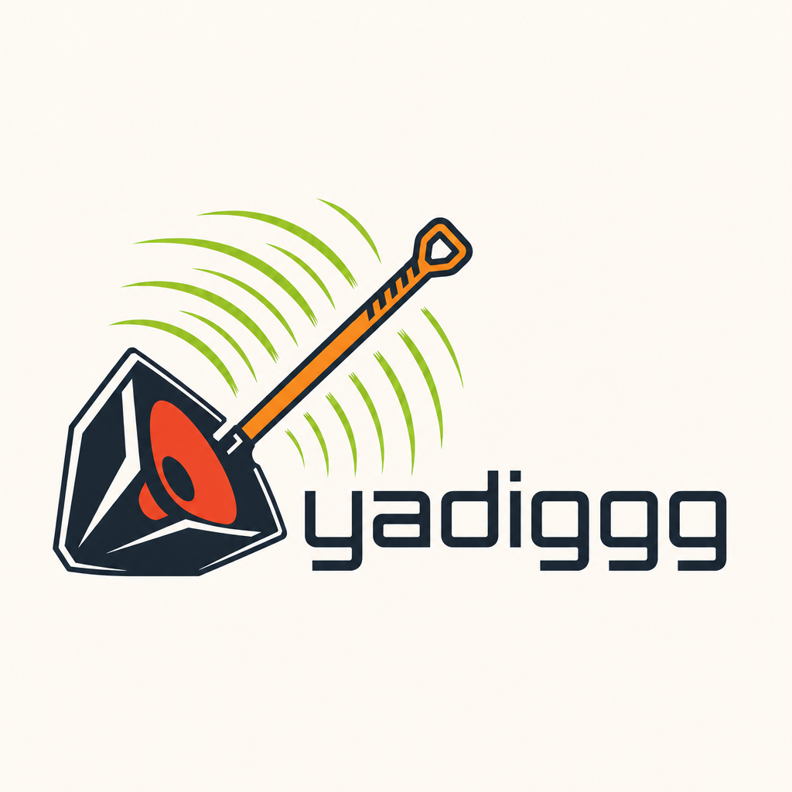
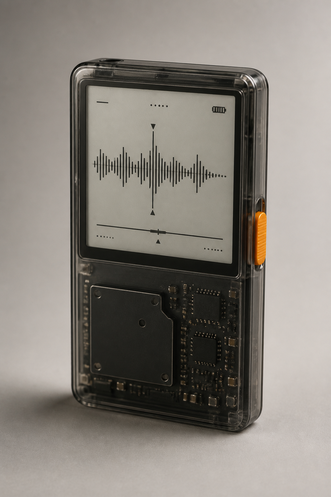
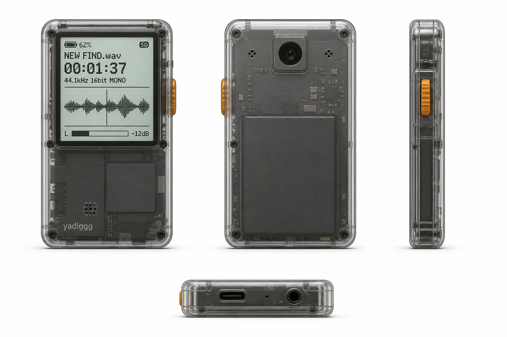
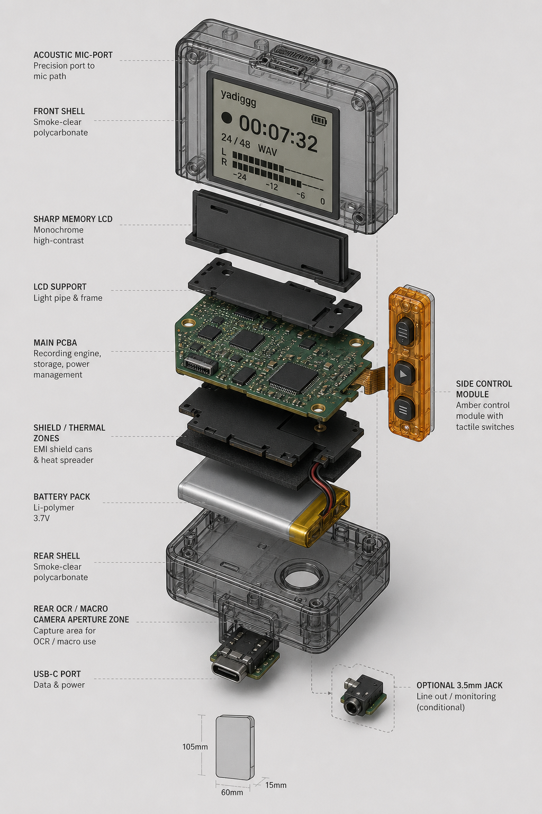
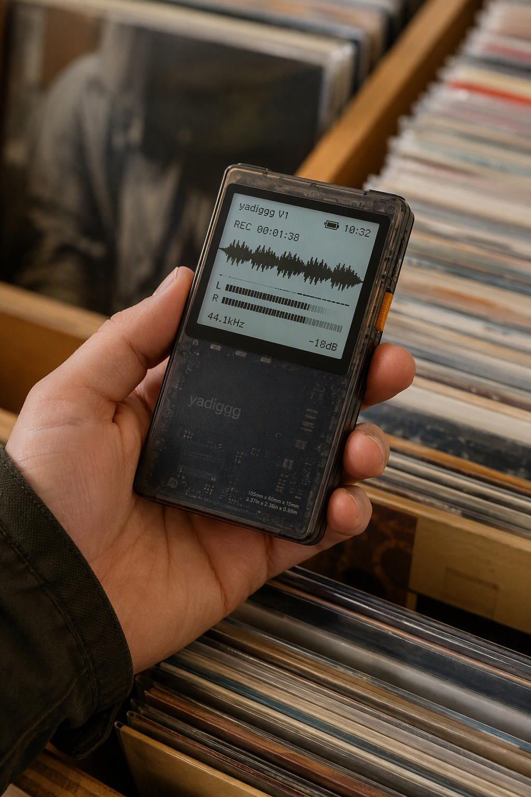

# yadiggg



> A compact smoke-clear pocket field recorder for vinyl crate digging.

**yadiggg** is a purpose-built hardware companion for people digging through records in shops, fairs, basements, collections, and back rooms. It is designed as a pocketable field recorder / record intelligence device: fast to grab, distraction-free, and visually rooted in vinyl culture.

The current V1 direction is a compact portrait-first device with a translucent shell, monochrome waveform display, one amber side control, restrained visible internals, and a shovel-speaker brand mark.



---

## Current V1 Direction

**Product identity:** `yadiggg`  
**Category:** pocket field recorder / crate-digging assistant  
**Form factor:** compact portrait-first handheld device  
**Envelope target:** 105mm x 60mm x 15mm-class, provisional  
**Visual language:** smoke-clear translucent hardware, monochrome waveform UI, amber/orange side control, visible but restrained dark internals

Current visual lock:

> yadiggg is a compact, portrait-first, 105mm x 60mm x 15mm-class pocket field recorder for vinyl crate digging, with a smoke-clear translucent polycarbonate shell, large monochrome Sharp Memory LCD on the upper front face, one durable amber/orange side thumb control, visible but restrained dark internal electronics, USB-C bottom port, optional 3.5mm jack if fit allows, tiny acoustic mic ports, and a provisional rear OCR/macro camera aperture.

Non-goals for the V1 visual direction:

- no keypad
- no Crate IQ branding
- no bulky walkie-talkie silhouette
- no generic spade/record logo
- no production-ready or fabrication-ready claims until CAD, BOM, schematic, and prototype validation are complete

---

## Product Visuals

### Orthographic render sheet



Use this image as the current visual bridge between product concept and mechanical discussion. It shows the front, back, side-control side, and bottom port edge in one consistent design language.

### Exploded stack concept



This is a conceptual/provisional internal stack render. It communicates assembly intent, but it is not a verified PCB layout, BOM, or production mechanical design.

### Lifestyle context



The product is intended to feel natural in a one-handed crate-digging workflow: record in one hand, yadiggg in the other, no phone required.

---

## Brand Direction


The current logo direction combines:

- a shovel/speaker hybrid mark
- an orange handle
- a simplified red/orange speaker cone
- green upward-right sound-wave energy
- a clean technical lowercase `yadiggg` wordmark

The logo is still an image-generation concept and needs a real vector package before production use.

Planned logo deliverables:

- full-color master
- one-color dark version
- one-color light version
- icon-only mark
- horizontal lockup
- stacked lockup
- small-size / shell-etch-safe version

---

## What This Repo Contains

```text
assets/                # Current public-facing product and logo visuals
physical-design/       # Product source of truth, CAD brief, render protocol, logo notes
hardware/              # KiCad project scaffolds and hardware notes
src/sonic_id/          # Sonic ID / audio fingerprinting prototype code
yocto-meta/            # Yocto layer scaffold
docs/                  # ADRs, project-state handoff, BOM/component notes
CONTEXT.md             # Master domain context and glossary
README.md              # Public project overview
```

### Primary source-of-truth documents

Start here:

- [Final Product Source of Truth](physical-design/final-product-source-of-truth.md)
- [Project State](docs/project-state.md)
- [Render Consistency Protocol](physical-design/render-consistency-protocol.md)
- [Placement Sketch](physical-design/placement-sketch.md)
- [CAD Block Model Brief](physical-design/cad-block-model-brief.md)
- [Logo Refinement Notes](physical-design/logo-refinement-round-1.md)
- [ADRs](docs/adr/)

---

## Development Status

This project is in **active design and prototyping**.

Current status:

| Area | Status |
|---|---|
| Visual identity | coherent V1 direction selected |
| Product renders | current concept set selected |
| CAD | block-model brief + OpenSCAD starter drafted |
| PCB / KiCad | scaffold/reference only, not fabrication-ready |
| BOM | needs reconciliation into `docs/bom-current.md` |
| Sonic ID | prototype C code, requires hardware validation |
| Yocto | layer scaffold, not verified on target hardware |
| Manufacturing | not ready |

Important caveat:

> Current visuals are design intent. They are not production CAD, not verified mechanical drawings, and not validated electrical layouts.

---

## Engineering Path Forward

Near-term work:

1. Convert the current logo into a real vector package.
2. Open/recreate the CAD block model from `physical-design/cad/yadiggg_v1_block_model.scad`.
3. Export measured front/back/side/bottom CAD views.
4. Decide whether the rear OCR/macro camera and optional 3.5mm jack stay.
5. Create `docs/bom-current.md`.
6. Choose the cloud EDA path: Flux.ai or EasyEDA Pro.
7. Rebuild schematic and PCB constraints from the source-of-truth docs.
8. Export a neutral prototype manufacturing package only after CAD/BOM/EDA validation.

---

## Philosophy

The record is the hero. yadiggg should be a transparent, purpose-built lens for revealing what is already inside the music: sound, history, metadata, context, and memory.

No phone spiral. No social feed. No generic gadget sludge.

Just a sharp little tool for diggers.
